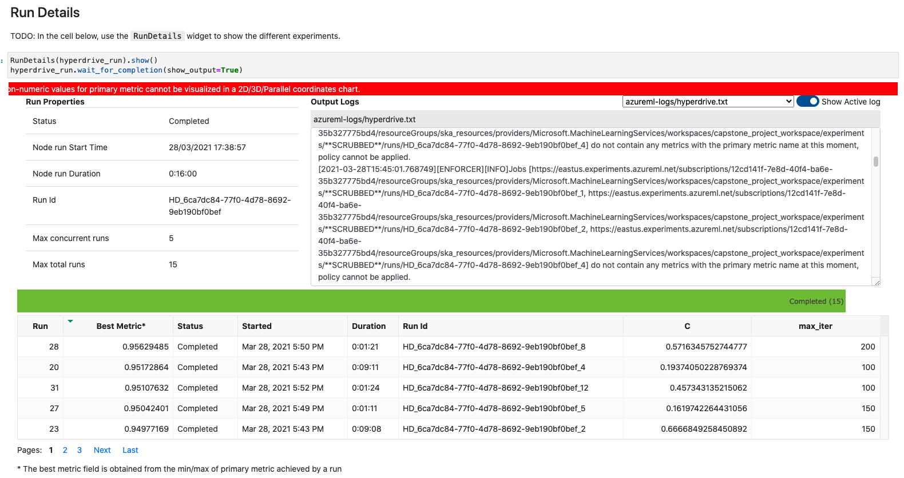

*NOTE:* This file is a template that you can use to create the README for your project. The *TODO* comments below will highlight the information you should be sure to include.

# Udacity Machine Learning Engineer - Capstone project

This project is the capstone project related to the Azure ML Engineer path, this is the final project.
The topic of the project will be to train a model with AutoML, train a model with HyperParameter and finally deploy the best model between the mentioned above.

## Project Set Up and Installation
*OPTIONAL:* If your project has any special installation steps, this is where you should put it. To turn this project into a professional portfolio project, you are encouraged to explain how to set up this project in AzureML.

## Dataset

### Overview
The dataset represents a dataset of stroke event, according to the World Health Organization (WHO) stroke is the 2nd leading cause of death globally, responsible for approximately 11% of total deaths.  The dataset is composed of these columns:

1) id: unique identifier
2) gender: "Male", "Female" or "Other"
3) age: age of the patient
4) hypertension: 0 if the patient doesn't have hypertension, 1 if the patient has hypertension
5) heart_disease: 0 if the patient doesn't have any heart diseases, 1 if the patient has a heart disease
6) ever_married: "No" or "Yes"
7) work_type: "children", "Govt_jov", "Never_worked", "Private" or "Self-employed"
8) Residence_type: "Rural" or "Urban"
9) avg_glucose_level: average glucose level in blood
10) bmi: body mass index
11) smoking_status: "formerly smoked", "never smoked", "smokes" or "Unknown"*
12) stroke: 1 if the patient had a stroke or 0 if not
*Note: "Unknown" in smoking_status means that the information is unavailable for this patient

For data analysis, the following columns need a normalization:
- gender: Male 1; Female 0;
- work_type: Private 1; Self-employed 0; others -1;
- bmi: N/A 0;
- Residence_type: Urban 1; Rural 0;
- smoking_status: smokes 1; never smoked -1; formerly smoked 2; others 0;

### Task
The task involve to predict strokes based on the different type of diseases, in fact in the dataset there are several people with different diseases and  habits, so we can try to have an insight about the correlation of these with stroke episodes.
We are going to find the best formant ML between HyperDriveParameter and AutoML.

### Access
The dataset is free and it can be downloade from [Kaggle](https://www.kaggle.com/fedesoriano/stroke-prediction-dataset), but I downloaded it and useed it in Azure ML.

## Automated ML
*TODO*: Give an overview of the `automl` settings and configuration you used for this experiment
AutoML configuration is exposed below:
```
automl_settings = {
    "n_cross_validations": 2,
    "experiment_timeout_minutes": 30,
    "max_concurrent_iterations": 5,
    "primary_metric" : 'AUC_weighted',
    "verbosity": logging.INFO
}

automl_config = AutoMLConfig(compute_target=compute_target,
                             task = "classification",
                             training_data=dataset,
                             label_column_name="stroke",   
                             path = project_folder,
                             enable_early_stopping= True,
                             featurization= 'auto',
                             debug_log = "automl_errors.log",
                             **automl_settings
                            )
```

### Results
We tried to perform different metric but this one we got the best result with the `AUC_weighted` metric. For the training as mentioned above, we use:
- primary_metric: AUC_weighted;
- n_cross_validations: 2;
- experiment_timeout_minutes: 30

We can try to improve increasing cross-correlation and experiment timeout because we tried accuracy as a metric with the worst result.


## Hyperparameter Tuning
We tune the follow hyper drive parameters:
- Regulation C: we use regularization to avoid overfitting so that we get more accurate predictions, so we choose a value between 0.1 and 1.0
- Max iteration:   Maximum number of iterations to converge (50,100,150,200,250)

### Results
We set the metric to `Accuracy` and metric goal to MAXIMIZE and we got an accuracy of ~95%.




## Model Deployment
We deployed the model, enabling Application insight, but without authentication. WARNING: this is a test but in production enable authentication is the better choice.


## Screen Recording

